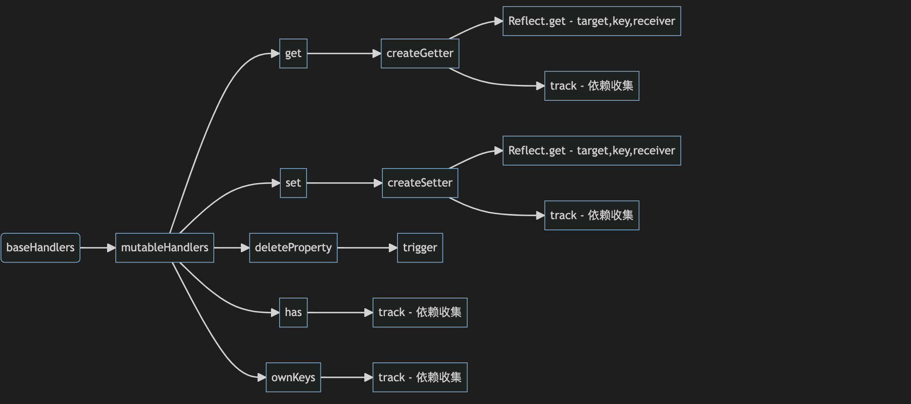

# reactivity 流程

> reactive

```mermaid
graph LR;
  a0[流程] --> a1[reactive]
  a0[流程] --> a2[init]
  a0[流程] --> a3[update]

  a1(reactive) --> a1-b[createReactiveObject创建响应式对象] --> a1-c[new Proxy]
  a1-c[new Proxy] --> a1-c1[基于 target 的类型区分获取 Handlers]
  a1-c[new Proxy] --> a1-c2[TargetType.COLLECTION]--> a1-c2-1[TargetType.COLLECTION] --> a1-c2-2[collectionHandlers] --> a1-c2-3[集合]
  a1-c[new Proxy] --> a1-c3[else]--> a1-c3-1[baseHandlers] --> a1-c3-2[非集合]

  a2(init) --> a2-b[effect fn]  --> a2-c[创建 effect] --> a2-d[执行 fn] --> a2-e[触发 get 操作]  --> f[执行 track] -->a2-g[把 effect 收集起来作为依赖]

  a3(update) --> a3-b[修改响应式对象的值] --> a3-c[触发 set 操作] --> a3-d[执行 trigger] --> a3-e[重新运行 effect 函数] --> a3-f[执行 fn] --> a3-g[触发 get 操作] --> a3-h[执行 track] --> a3-i[把 effect 收集起来作为依赖]
```

> baseHandlers

```mermaid
graph LR;
  a(baseHandlers) --> b[mutableHandlers]

  b[mutableHandlers] --> b1[get] --> c1[createGetter]
  c1[createGetter] --> c1-1[Reflect.get - target,key,receiver]
  c1[createGetter] --> c1-2[track - 依赖收集]

  b[mutableHandlers] --> b2[set] --> c2[createSetter]
  c2[createSetter] --> c2-1[Reflect.get - target,key,receiver]
  c2[createSetter] --> c2-2[track - 依赖收集]

  b[mutableHandlers] --> b3[deleteProperty] --> c3[trigger]

  b[mutableHandlers] --> b4[has] --> c4[track - 依赖收集]

  b[mutableHandlers] --> b5[ownKeys] --> c5[track - 依赖收集]
```
